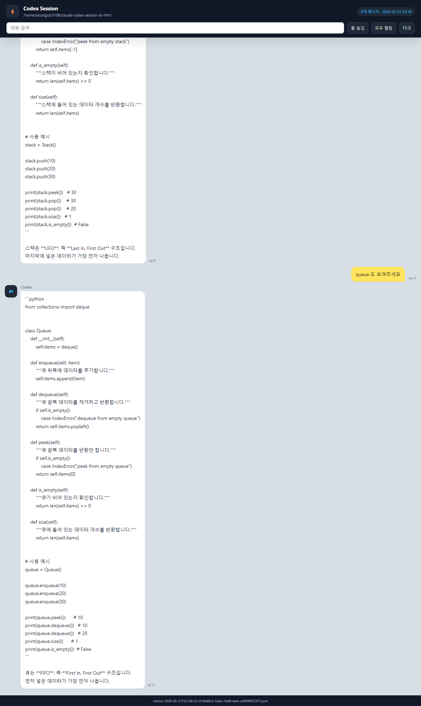

# claude-codex-session-to-html

WSL에서 실행하는 **Claude Code / Codex CLI** 세션 대화를 Windows 폴더에 검색 가능한 HTML 채팅 로그로 자동 저장하는 도구입니다.

Windows에서 WSL 안의 `claude` 또는 `codex`를 사용하는 사람을 위한 도구입니다. WSL 홈 디렉터리의 세션 파일을 감시하고, 생성된 HTML은 설치 중 사용자가 선택한 Windows 폴더에 저장합니다.

[English README](./README.md)

<br>

## Preview

| Claude Code | Codex CLI |
|---|---|
| 회색 헤더 `AI` | 다크 헤더 `AI` |
| 노란 말풍선 (사용자) | 노란 말풍선 (사용자) |
| 흰 말풍선 (AI) | 흰 말풍선 (AI) |
| 툴 호출/결과 클릭 펼침 | 툴 호출/결과 클릭 펼침 |




<br>

## 기능

- Claude Code와 Codex CLI 세션을 로컬 HTML 파일로 저장합니다.
- `inotifywait`로 JSONL 세션 파일 변경을 실시간 감지합니다.
- CLI가 강제 종료되어도 watcher가 마지막 감지 시점까지 내용을 보존합니다.
- 검색, 다크 모드, 툴 로그 접기/펼치기를 지원하는 채팅 UI로 렌더링합니다.
- CLI/MCP 검색과 진행상황 회상을 위해 로컬 `index.sqlite` 파일을 생성합니다.
- 기존 Claude Code hook을 보존하고 필요한 Stop hook만 중복 없이 추가합니다.
- 핵심 HTML/index/CLI 기능은 Bash와 Python 표준 라이브러리만 사용합니다.
- MCP 서버 기능은 선택 사항이며 사용할 때만 `mcp` Python 패키지가 필요합니다.

<br>

## 요구사항

- Windows 11 + WSL2, Ubuntu 계열 환경 권장
- Claude Code 또는 Codex CLI를 Windows PowerShell/CMD가 아니라 WSL 안에서 실행해야 합니다.
- Python 3.8+
- `inotify-tools` (설치 스크립트가 없으면 자동 설치)
- Claude Code (`claude`) 또는 Codex CLI (`codex`) 중 하나 이상

<br>

## 설치

WSL 터미널을 열고, `claude` 또는 `codex`를 실행하는 **동일한 WSL 사용자 계정**에서 설치하세요.

```bash
git clone https://github.com/bbungjun/claude-codex-session-to-html.git
cd claude-codex-session-to-html
chmod +x install.sh
./install.sh
```

설치 중 Windows 사용자 이름과 Desktop 폴더를 자동으로 감지합니다. 사용자 이름 감지 실패 시 직접 입력합니다.
또한 대화 history/index 파일을 저장할 폴더를 물어봅니다. Enter를 누르면 감지된 Desktop 아래 `session_history` 폴더를 사용하고, 원하면 WSL 경로나 Windows 경로를 직접 입력할 수 있습니다.

설치된 스크립트는 아래 위치에 복사됩니다.

```bash
~/.claude/hooks/
```

일반 사용자로 Claude Code나 Codex CLI를 실행한다면 `root`에만 설치하면 안 됩니다. watcher는 현재 WSL 사용자의 `$HOME` 아래 세션 폴더를 감시합니다.

<br>

## 저장 위치

기본 저장 위치는 감지된 Windows Desktop 폴더 아래입니다.

```text
<Windows Desktop>\session_history\
```

설치 중 다른 저장 폴더를 입력할 수 있습니다. `/mnt/d/AISessions` 같은 WSL 경로를 쓰거나, `D:\AISessions` 같은 Windows 경로를 입력하면 `wslpath`가 있는 환경에서 자동 변환합니다.

```text
Session history/index output directory, WSL or Windows path [default: <detected-desktop>/session_history]:
```

예를 들어 `/mnt/d/AISessions` 또는 `D:\AISessions`를 입력하면 아래 위치에 저장됩니다.

```text
D:\AISessions\
```

각 세션은 아래 파일명으로 저장됩니다.

```text
<session-uuid>.html
```

같은 출력 폴더에 아래 파일도 함께 생성됩니다.

```text
index.sqlite
```

HTML archive remains the primary visual output. SQLite index enables local search.

저장 위치는 설치 시 선택한 폴더로 결정됩니다. 설치 스크립트가 설치된 변환 스크립트의 `OUTPUT_DIR`에 선택한 경로를 기록합니다.

설치 후 저장 위치를 바꾸려면 `./install.sh`를 다시 실행하거나, 아래 두 파일의 `OUTPUT_DIR` 값을 원하는 WSL 경로로 수정하세요.

```bash
~/.claude/hooks/session_to_html.py
~/.claude/hooks/codex_to_html.py
```

<br>

## 동작 방식

```text
Claude Code / Codex CLI
  -> JSONL 세션 파일 기록
  -> session_watcher.sh가 변경 감지
  -> Python 변환기가 HTML 재생성
  -> Windows 출력 폴더에 HTML 저장
```

watcher가 감시하는 세션 폴더:

```bash
$HOME/.claude/projects
$HOME/.codex/sessions
```

Claude Code는 Stop hook도 등록되어 세션이 정상 종료될 때 최종 HTML을 다시 생성합니다.

<br>

## 수동 변환

```bash
# Claude Code 최근 세션
echo '{"session_id":""}' | python3 ~/.claude/hooks/session_to_html.py

# Codex CLI 최근 세션
echo '{}' | python3 ~/.claude/hooks/codex_to_html.py
```

<br>

## CLI 검색

CLI search is available without MCP. 설치 스크립트는 `session_memory` 패키지를 `~/.claude/hooks` 아래에 복사하므로, clone 받은 repo 밖에서 실행할 때는 `PYTHONPATH`를 지정하세요.

```bash
PYTHONPATH="$HOME/.claude/hooks" \
python3 -m session_memory.cli search pipeline \
  --db /mnt/c/Users/<you>/Desktop/session_history/index.sqlite
```

대략적인 시간 표현을 함께 넣을 수도 있습니다.

```bash
PYTHONPATH="$HOME/.claude/hooks" \
python3 -m session_memory.cli search "어제 3시 pipeline" \
  --db /mnt/c/Users/<you>/Desktop/session_history/index.sqlite
```

개발 진행상황 질문은 `progress` 명령을 사용합니다.

```bash
PYTHONPATH="$HOME/.claude/hooks" \
python3 -m session_memory.cli progress \
  --project agent-chat \
  --topic pipeline \
  --db /mnt/c/Users/<you>/Desktop/session_history/index.sqlite
```

<br>

## MCP 서버

MCP server requires optional pip install mcp.

```bash
pip install mcp
```

저장 폴더의 SQLite index를 지정해서 MCP 서버를 실행합니다.

```bash
PYTHONPATH="$HOME/.claude/hooks" \
SESSION_MEMORY_DB=/mnt/c/Users/<you>/Desktop/session_history/index.sqlite \
python3 -m session_memory.mcp_server
```

예시 질문:

```text
어제 3시에 어떤 대화를 했었지?
agent chat bot pipeline 구조를 어디까지 구현했지?
관련 HTML 세션을 열어줘.
```

<br>

## 성능 메모

watcher는 기본적으로 3초 debounce를 사용합니다. Claude/Codex가 세션 파일에 아주 자주 기록할 때 HTML과 SQLite index를 매번 재생성하지 않도록 하기 위해서입니다. watcher를 직접 시작할 때 아래처럼 조절할 수 있습니다.

```bash
SESSION_WATCHER_DEBOUNCE=5 nohup ~/.claude/hooks/session_watcher.sh > ~/.claude/hooks/watcher.log 2>&1 & disown
```

SQLite index는 모든 메시지를 보관하지만, 전문 검색 대상은 사용자/assistant 메시지로 제한합니다. tool output은 생성된 HTML과 세션 상세에는 남지만 기본 검색에서는 제외됩니다. 또한 변경 없는 세션은 index 쓰기를 건너뛰고, 세션이 길어질 때는 새 메시지만 append합니다.

<br>

## 문제 해결

```bash
# watcher 상태 확인
pgrep -f session_watcher.sh && echo "실행 중" || echo "꺼져 있음"

# 로그 확인
tail -f ~/.claude/hooks/watcher.log

# watcher 재시작
pkill -f session_watcher.sh
nohup ~/.claude/hooks/session_watcher.sh > ~/.claude/hooks/watcher.log 2>&1 & disown
```

watcher가 실행 중인데 새 날짜/새 세션 HTML이 생성되지 않으면 watcher를 재시작하세요.

<br>

## 보안 주의

생성된 HTML에는 프롬프트, 로컬 경로, 명령 출력, 소스 코드 일부, 토큰/키 같은 민감정보가 평문으로 포함될 수 있습니다. Generated logs and indexes may contain sensitive data. 생성된 세션 HTML과 `index.sqlite`를 공개 저장소에 커밋하거나 공유 폴더에 두지 마세요.

## 저장소

https://github.com/bbungjun

<br>

## 삭제

설치했던 것과 동일한 WSL 사용자 계정에서 실행하세요.

```bash
pkill -f session_watcher.sh 2>/dev/null || true
rm -f ~/.claude/hooks/session_to_html.py
rm -f ~/.claude/hooks/codex_to_html.py
rm -f ~/.claude/hooks/session_watcher.sh
rm -f ~/.claude/hooks/watcher.log
```

`~/.bashrc`의 자동 시작 블록을 제거합니다.

```bash
python3 - <<'PY'
from pathlib import Path

bashrc = Path.home() / ".bashrc"
start = "# claude-codex-session-to-html start"
end = "# claude-codex-session-to-html end"

if bashrc.exists():
    text = bashrc.read_text()
    if start in text and end in text:
        before = text[:text.index(start)].rstrip()
        after = text[text.index(end) + len(end):].lstrip()
        bashrc.write_text("\n\n".join(p for p in (before, after) if p) + "\n")
PY
```

`~/.claude/settings.json`의 Claude Code Stop hook을 제거합니다.

```bash
python3 - <<'PY'
import json
from pathlib import Path

settings = Path.home() / ".claude" / "settings.json"
command = f"python3 {Path.home()}/.claude/hooks/session_to_html.py"

if settings.exists():
    data = json.loads(settings.read_text())
    hooks = data.get("hooks")
    if isinstance(hooks, dict):
        stop_hooks = hooks.get("Stop", [])
        if isinstance(stop_hooks, list):
            hooks["Stop"] = [
                group for group in stop_hooks
                if not (
                    isinstance(group, dict)
                    and any(
                        isinstance(hook, dict) and hook.get("command") == command
                        for hook in group.get("hooks", [])
                    )
                )
            ]
    settings.write_text(json.dumps(data, indent=2) + "\n")
PY
```

생성된 HTML 파일은 자동으로 삭제하지 않습니다. 더 이상 필요 없으면 직접 삭제하세요.

```bash
rm -rf <selected-output-directory>
```
