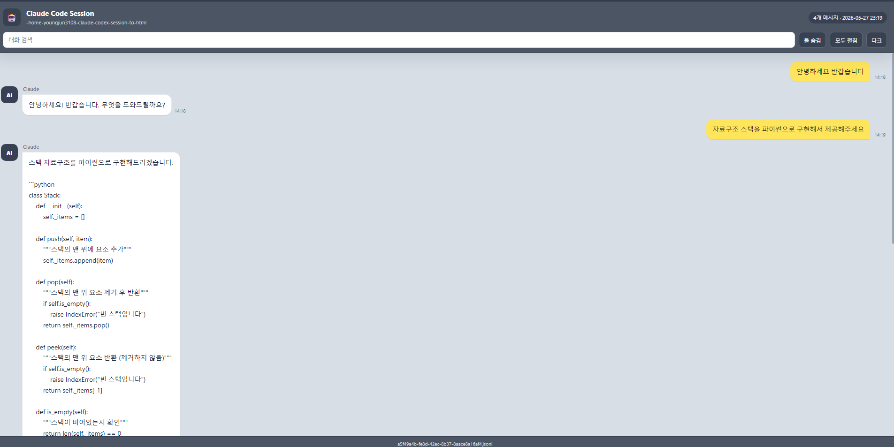

# claude-codex-session-to-html

Automatically save **Claude Code** and **Codex CLI** sessions from WSL as searchable HTML chat logs on Windows.

This is for Windows users who run `claude` or `codex` inside WSL. It watches the session files in your WSL home directory and writes the generated HTML files to a Windows folder that you choose during installation.

[한국어 문서](./README.ko.md)

## Preview

| Claude Code | Codex CLI |
|---|---|
| Gray header `AI` | Dark header `AI` |
| User messages in yellow bubbles | User messages in yellow bubbles |
| Assistant messages in white bubbles | Assistant messages in white bubbles |
| Expandable tool calls/results | Expandable tool calls/results |



## Features

- Archives Claude Code and Codex CLI sessions to local HTML files.
- Watches live JSONL session updates with `inotifywait`.
- Preserves recent content even if the CLI session is interrupted.
- Renders messages in a chat-style UI with search, dark mode, and collapsible tool logs.
- Keeps existing Claude Code hooks and adds only the required Stop hook.
- Uses only Bash and Python standard library code.

## Requirements

- Windows 11 + WSL2, tested with Ubuntu-style environments
- Claude Code or Codex CLI must be run inside WSL, not only from native Windows PowerShell/CMD
- Python 3.8+
- `inotify-tools` (`install.sh` installs it when missing)
- Claude Code (`claude`) or Codex CLI (`codex`)

## Install

Open your WSL terminal and run the installer from the same WSL user account that runs `claude` or `codex`.

```bash
git clone https://github.com/bbungjun/claude-codex-session-to-html.git
cd claude-codex-session-to-html
chmod +x install.sh
./install.sh
```

The installer detects your Windows username and Desktop folder. If username detection fails, it asks you to enter it manually.
It also asks where to store session history/index files. Press Enter to use the detected Desktop `session_history` folder, or enter any WSL or Windows path.

Installed scripts are copied to:

```bash
~/.claude/hooks/
```

Do not install only as `root` unless you also run Claude Code or Codex CLI as `root`. The watcher monitors session files under the current WSL user's `$HOME`.

## Output

By default, HTML files are saved under your detected Windows Desktop folder:

```text
<Windows Desktop>\session_history\
```

During installation, you can choose a different output directory. Use a WSL path such as `/mnt/d/AISessions`, or enter a Windows path such as `D:\AISessions` and the installer will convert it when `wslpath` is available.

```text
Session history/index output directory, WSL or Windows path [default: <detected-desktop>/session_history]:
```

For example, entering `/mnt/d/AISessions` or `D:\AISessions` saves files to:

```text
D:\AISessions\
```

Each session is saved as:

```text
<session-uuid>.html
```

The selected output path is written into the installed converter scripts during installation. To change it after installing, rerun `./install.sh` or edit `OUTPUT_DIR` in:

```bash
~/.claude/hooks/session_to_html.py
~/.claude/hooks/codex_to_html.py
```

## How It Works

```text
Claude Code / Codex CLI
  -> writes JSONL session files
  -> session_watcher.sh detects updates
  -> Python converter regenerates HTML
  -> HTML is saved to the Windows output folder
```

Watched session directories:

```bash
$HOME/.claude/projects
$HOME/.codex/sessions
```

Claude Code also gets a Stop hook so the final HTML is regenerated when a session exits normally.

## Manual Conversion

```bash
# Latest Claude Code session
echo '{"session_id":""}' | python3 ~/.claude/hooks/session_to_html.py

# Latest Codex CLI session
echo '{}' | python3 ~/.claude/hooks/codex_to_html.py
```

## Troubleshooting

```bash
# Check watcher
pgrep -f session_watcher.sh && echo "running" || echo "stopped"

# Read logs
tail -f ~/.claude/hooks/watcher.log

# Restart watcher
pkill -f session_watcher.sh
nohup ~/.claude/hooks/session_watcher.sh > ~/.claude/hooks/watcher.log 2>&1 & disown
```

If the watcher is running but a new date/session folder is not being archived, restart the watcher.

## Security

Generated HTML files can contain prompts, local paths, command output, source snippets, tokens, keys, or other sensitive data. Do not commit generated session HTML files or place the output folder in a public/shared location.

## Repository

https://github.com/bbungjun

## Uninstall

Run this from the same WSL user account where you installed the tool.

```bash
pkill -f session_watcher.sh 2>/dev/null || true
rm -f ~/.claude/hooks/session_to_html.py
rm -f ~/.claude/hooks/codex_to_html.py
rm -f ~/.claude/hooks/session_watcher.sh
rm -f ~/.claude/hooks/watcher.log
```

Remove the auto-start block from `~/.bashrc`:

```bash
python3 - <<'PY'
from pathlib import Path

bashrc = Path.home() / ".bashrc"
start = "# claude-codex-session-to-html start"
end = "# claude-codex-session-to-html end"

if bashrc.exists():
    text = bashrc.read_text()
    if start in text and end in text:
        before = text[:text.index(start)].rstrip()
        after = text[text.index(end) + len(end):].lstrip()
        bashrc.write_text("\n\n".join(p for p in (before, after) if p) + "\n")
PY
```

Remove the Claude Code Stop hook from `~/.claude/settings.json`:

```bash
python3 - <<'PY'
import json
from pathlib import Path

settings = Path.home() / ".claude" / "settings.json"
command = f"python3 {Path.home()}/.claude/hooks/session_to_html.py"

if settings.exists():
    data = json.loads(settings.read_text())
    hooks = data.get("hooks")
    if isinstance(hooks, dict):
        stop_hooks = hooks.get("Stop", [])
        if isinstance(stop_hooks, list):
            hooks["Stop"] = [
                group for group in stop_hooks
                if not (
                    isinstance(group, dict)
                    and any(
                        isinstance(hook, dict) and hook.get("command") == command
                        for hook in group.get("hooks", [])
                    )
                )
            ]
    settings.write_text(json.dumps(data, indent=2) + "\n")
PY
```

Generated HTML files are not deleted automatically. Remove them manually if you no longer need them:

```bash
rm -rf <selected-output-directory>
```
